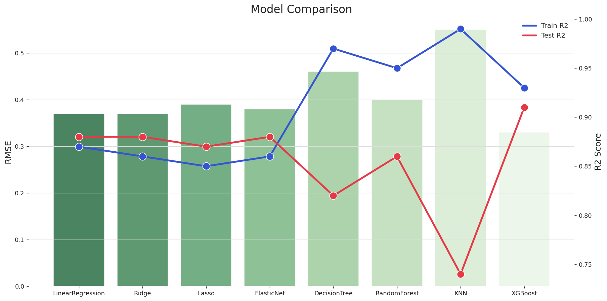
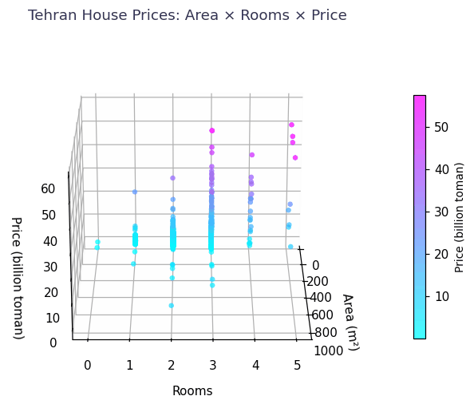
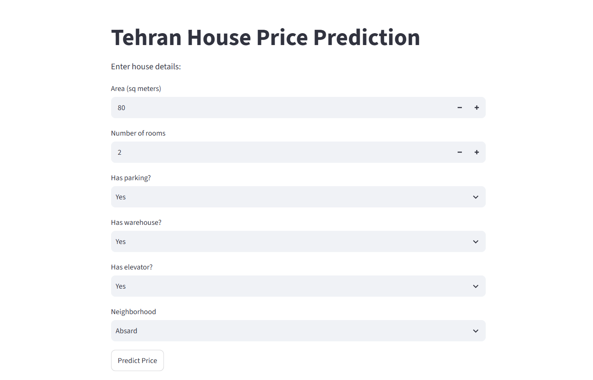

<div align="center">


[](https://git.io/typing-svg)


</div>

---

## What this is


A house price prediction model for Tehran, built on real Divar listing data (area, rooms, amenities, neighborhood). It started as a teaching notebook with a handful of classic ML models; I took it further — found and fixed a nasty bug hiding in the raw data, wrote two neural nets from scratch in PyTorch, tracked training with Weights & Biases, and shipped a bilingual web app that actually works.


## Results at a glance

| Rank | Model | R² | RMSE |
|:---:|---|:---:|:---:|
| 🥇 | XGBoost | 0.906 | 0.332 |
| 🥈 | Ridge Regression | 0.881 | 0.373 |
| 🥉 | Neural Net (128-64-32 + Dropout) | 0.865 | 0.398 |

10 models compared in total, from plain linear regression up to a custom neural net. Full breakdown is in the notebook.

<div align="center">

</div>

## Exploring the data in 3D

Area, number of rooms, and price, all in one plot — color shows price.

<div align="center">

</div>

Want to actually drag and rotate it yourself? Download [`assets/interactive_3d_chart.html`](assets/interactive_3d_chart.html) and open it in your browser (GitHub can't run interactive charts inline, but this file is fully interactive locally).

## The part that made this interesting   

I spent more time debugging than training models. Early on, plain linear regression gave an R² of basically zero — no signal at all. After a few hours of digging, I found 4 rows where the `Area` value had accidentally been copied from the `Price` column (a several-billion-square-meter "house"!). Dropping those 4 rows took R² from zero to 0.88 instantly.

Then the neural net had its own drama: the second version trained for 3000 epochs and quietly overfit after epoch 1800 — test loss jumped from 0.18 to over 10. Fixed it with a manual early-stopping loop that snapshots the model weights every time test loss improves.

## Neural net architecture (best version)

```
Input (103 features)
      │
   Linear(103 → 128) → ReLU → Dropout(0.3)
      │
   Linear(128 → 64) → ReLU → Dropout(0.3)
      │
   Linear(64 → 32) → ReLU
      │
   Linear(32 → 1)
      │
  Predicted log(Price)
```

## Web app demo

A bilingual (Persian/English) Streamlit app — enter the area, rooms, amenities and neighborhood, get a predicted price back instantly.

<div align="center">

</div>

## Project structure

```
📦 house-price-prediction
├── data/
│   └── tehranhouses.csv         # raw dataset
├── sample.ipynb                 # full analysis, modeling, and training
├── app.py                       # Streamlit web app
├── house_price_model.pth        # trained neural net weights
├── scaler.pkl                   # StandardScaler used in preprocessing
├── feature_columns.pkl          # exact feature order the model expects
├── requirements.txt
├── assets/
│   ├── house_animation.gif
│   ├── model_comparison.png
│   ├── rotating_3d_scatter.gif
│   ├── interactive_3d_chart.html
│   └── webapp_screenshot.png
└── README.md                     # you're reading it
```

## Running it

```bash
pip install -r requirements.txt
streamlit run app.py
```

Then open `localhost:8501` and fill in the house details.

## Training logs (WandB)

Live train/test loss curves for both neural net versions:
🔗 [wandb.ai/zahrarahgoshaa-prohect/house-price-prediction](https://wandb.ai/zahrarahgoshaa-prohect/house-price-prediction)

---

<div align="center">


</div>
</div>
